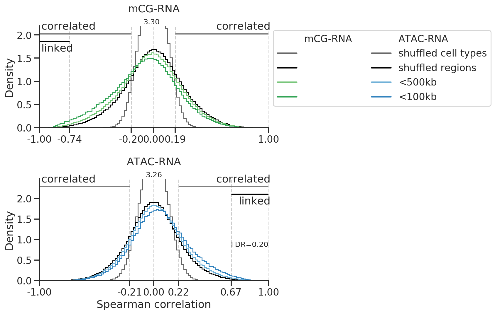

# Robust enhancer-gene association prediction using single cell transcriptomes and epigenomes


This repository hosts customized scripts for the analysis of enhancer-gene associations in neurons from mouse primary motor cortex.

Reference:
- [Xie, Armand et al. 2021; Robust enhancer-gene regulation identified by single-cell transcriptomes and epigenomes](https://www.biorxiv.org/content/10.1101/2021.10.25.465795v1)

Correspondence: [Fangming Xie](mailto:f7xie@ucsd.edu) and [Eran A. Mukamel](mailto:emukamel@ucsd.edu)

# Getting started
**System requirements**

This package is tested on a Ubuntu 18.04.6 LTS (Bionic Beaver) server. However, we expect it can be operated under a wide range of systems.
We recommend users to use a [conda environment](https://docs.conda.io/projects/conda/en/latest/user-guide/getting-started.html) to install dependencies. This requires users to pre-install [Anaconda](https://www.anaconda.com/products/individual).

**Installation**

Run the following command to clone this repo and install dependencies.
```bash

# clone this repo
git clone https://github.com/mukamel-lab/SingleCellFusion_EnhancerPaper.git

# create an conda env and install dependancies.
cd SingleCellFusion_EnhancerPaper
conda env create -f env.yml
```
The installation of the conda environment takes less than 20 minutes. After installation, activate the environment using
```bash
conda activate env_enhancer
```

**Demo**

First download demo data, which includes mC, ATAC, and RNA profiles for >70,000 neurons from mouse primary motor cortex:
- Use [this](https://drive.google.com/file/d/1FHjSn4MuNz7nxE7h_Ib8oiJcjm8XZaOs/view?usp=sharing) link to download.

Put `data.tar.gz` under the `demo` directory of this repo, and decompress it:
```bash
mv data.tar.gz ./demo
tar -zxvf data.tar.gz 
```

Now you can run our enhancer-gene association analysis using a single command:
```
cd demo
 ./run_pipe_mc.sh & ./run_pipe_atac.sh
```
This will generate a result folder that includes metacells, kNN graphs between modalities, and the correlations of all enhancer-gene pairs within 1Mb for mC-RNA and ATAC-RNA, respectively. For speed, this demo uses only 10% of cells for each dataset based on random sampling.

To visualize the results, then run through the `visualize_correlation.ipynb` jupyter notebook. This will generate results that recapitulate the key findings of the paper.



The whole demo takes about 5 minutes to run through.

**Run your data**

You need to replace our example data folder `demo/data` with your own data. As in `demo/data`, you would need:
- a gene list
- an enhancer list
- a list of enhancer-gene pairs to examine (default uses all pairs within 1Mbp)
- count matrices (cell-by-gene for RNA; cell-by-enhancer for mC and ATAC)
- feature matrices (cell-by-gene for RNA, mC and ATAC; preprocessed and normalized; this is used to generate metacells)

