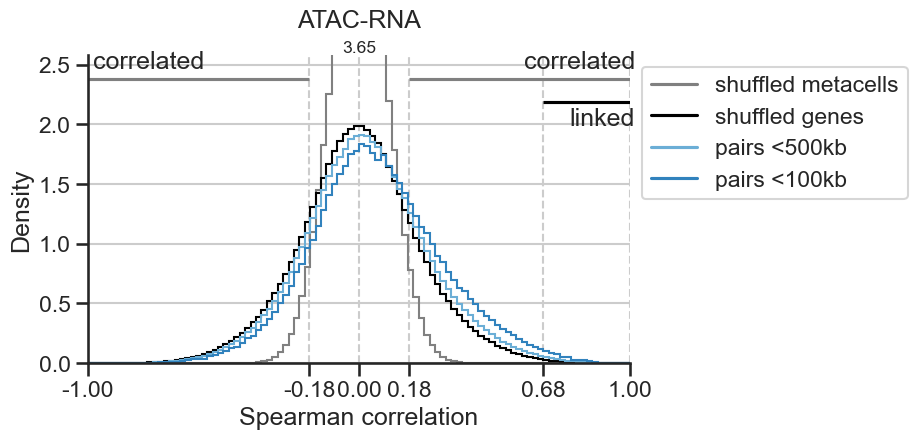
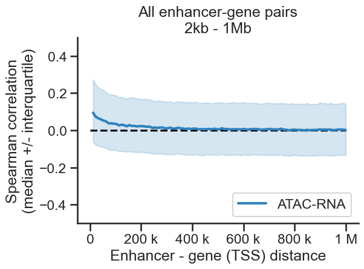
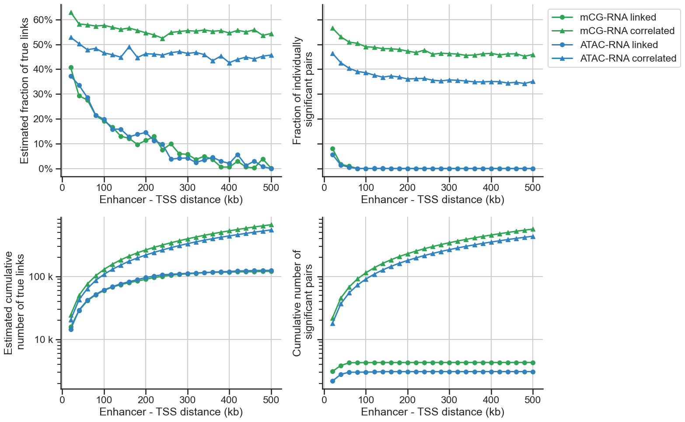

# Robust enhancer-gene association prediction using single cell transcriptomes and epigenomes


This repository hosts the package `robustlink`, a tool that integrates single-cell transcriptomes (scRNA-seq) and epigenomes (snATAC-seq and snmC-seq) and identifies robust associations between cis-regulatory elements (enhancers) and genes. 

Reference:
- [Xie, Armand et al. 2021; Robust enhancer-gene regulation identified by single-cell transcriptomes and epigenomes](https://www.biorxiv.org/content/10.1101/2021.10.25.465795v1)

Correspondence: [Fangming Xie](mailto:f7xie@ucsd.edu) and [Eran A. Mukamel](mailto:emukamel@ucsd.edu)

# Getting started
### System requirements ###

This package is tested on a Ubuntu 18.04.6 LTS (Bionic Beaver) server. However, we expect it can be operated under a wide range of systems.
We recommend users to use a [conda environment](https://docs.conda.io/projects/conda/en/latest/user-guide/getting-started.html) to install dependencies. This requires users to pre-install [Anaconda](https://www.anaconda.com/products/individual).

### Installation ###

```bash
# clone this repo
git clone https://github.com/FangmingXie/robustlink.git

# setting up the environment and install dependancies using the provided `env.yml` file.
conda env create -f ./robustlink/env.yml
conda activate env_robustlink 

# install this package using pip from PyPI
pip install robustlink
```

### Demo ###

The `demo/` directory contains an example usage of this package, by linking enhancer-gene pairs using single-cell transcriptomes (scRNA-seq) and epigenome (snmC-seq, snATAC-seq). 

```bash
cd ./robustlink/demo
```

1. The demo data, which includes mC, ATAC, and RNA profiles for >70,000 neurons from mouse primary motor cortex, can be downloaded with [this](https://drive.google.com/file/d/1JzP6cPTWFMj4vj5-Ie8QWBl8rpfnJa37/view?usp=sharing) link. Once downloaded, decompress it with the following command. For detailed description of data files, see `README_demodata.txt`.
```bash
# decompress the data under the demo/ directory
tar -zxvf demodata.tar.gz
```

*After the data is in place. The rest of the demo takes about 5 minutes to run through.*

2. With the `demodata` in place, you can run through the entire enhancer-gene association analysis with the following command:
```bash
# run the two scripts under demo/ that links mCG-RNA and ATAC-RNA respectively.
 ./link_mc_rna.sh && ./link_atac_rna.sh
```
This will generate a result folder `demoresults` that includes integrated datasets, metacells, and correlations between enhancers and genes for mC-RNA and ATAC-RNA, respectively. For speed, this demo only randomly samples 10% cells from each dataset. However, the users can readily make the change to use more cells by tuning the `-s/--subsample_frac` argument. 

3. To visualize the results, run through the `visualize_links.ipynb` notebook, which generates visualizations with a few simple commands backed by our customized `CorrRes` class. See section **Visualization** below for more details.



### Prepare your data ###

You need to prepare your data as in the demo in `.h5ad` ([AnnData](https://anndata.readthedocs.io/en/latest/)) format. Specifically, for each dataset you need:
- `counts_${dataset}.h5ad`: a count matrix (cell-by-gene for RNA; cell-by-enhancer for mC and ATAC) of the single-cell transcriptome/epigenome data.
- `gene_profiles_${dataset}.h5ad`: a gene-level feature matrix (average gene-level DNA methylation or ATAC signals for epigenome data). This information is not directly used for enhancer-gene association, but only to integrate cells from different datasets to identify cross-dataset metacells.

In addition, you need annotation file tables (.tsv):
- a gene list
- an enhancer list
- a enhancer-gene pair list (e.g. all pairs within ~1Mbp)

### CLI ###
On the top level, there are three main functions to choose from: 
- `scfusion`: integrate datasets (transcriptomes and epigenomes)
- `metacell`: generate metacells (cell clusters) that are shared across datasets
- `corr_mc` or `corr_atac`: correlate enhancer epigenetic signals (mc or atac) with gene expression 

Run ```python -m robustlink --help``` will show the available secondary options to choose from:
```
usage: python -m robustlink [-h] {scfusion,metacell,corr_mc,corr_atac} ...
```

Each option requires specific input arguments that can be revealed by their own `--help` function. 
```bash
python -m robustlink scfusion --help
```
```
usage: python -m robustlink scfusion [-h] -i DATA_DIR -o OUTDIR -id INPUT_DATASETS [INPUT_DATASETS ...] -im INPUT_MODALITIES
                                  [INPUT_MODALITIES ...] -fd FEATURE_DATASETS [FEATURE_DATASETS ...] [-tag NAMETAG]
                                  [--ka_smooth KA_SMOOTH] [--knn KNN] [-s SUBSAMPLE_FRACTION] [-sn SUBSAMPLE_TIMES]
                                  [--relaxation RELAXATION] [--drop_npcs DROP_NPCS]
                                  [--smoothing_fractions SMOOTHING_FRACTIONS [SMOOTHING_FRACTIONS ...]] [--num_pcs NUM_PCS]
...
```

```bash
python -m robustlink metacell --help
```
```
usage: python -m robustlink metacell [-h] -i INPUT_DATASET -o OUT_DIR -tag INPUT_NAME_TAG -sn SUBSAMPLE_TIMES -r RESOLUTIONS
                                  [RESOLUTIONS ...]
...                                  
```

```bash
python -m robustlink corr_mc --help
```
```
usage: python -m robustlink corr_mc [-h] --tolink TOLINK --countdata_gene COUNTDATA_GENE --countdata_enh COUNTDATA_ENH -o OUT_DIR
                                 --scfusion_dir SCFUSION_DIR --fusiondata_rna FUSIONDATA_RNA --fusiondata_mc FUSIONDATA_MC -tag
                                 INPUT_NAME_TAG [-isub I_SUB] [-ct {pearsonr,spearmanr}] [-f] [-n NUM_METACELL_LIMIT]
...
```

### Visualization ###

We designed the visualization module to be simple and flexible to use at the same time. Once setting up the `CorrRes` object, it takes one line to generate visualizations. Below are a few examples.

```python
# corr_res_mc is a CorrRes object generated as in visualize_links.ipynb
corr_res_mc.plot_corr_vs_dist()
```


```python
corr_res_atac.plot_corr_vs_dist()
```


```python
corr_res_mc.plot_corr_vs_dist()
```


```python
corr_res_atac.plot_corr_vs_dist()
```



With a few minor changes, we can combine the two plots above into a single one, and control other figure properties as you like using the `axes` handles from [matplotlib](https://matplotlib.org/stable/index.html).
```python
fig, ax = plt.subplots(figsize=(6,4))
corr_res_mc  .plot_corr_vs_dist(ax)
corr_res_atac.plot_corr_vs_dist(ax)
plt.show()
```


Below is a more complex example of how we can combine subplots.
```python
cols = [
    'frac_tp', 
    'sig_frac_tp', 
    'num_pos',
    'sig_num_pos',
]

fig, axs = plt.subplots(2, 2, figsize=(8*2,5*2), sharex=False, sharey='row')
for ax, col in zip(axs.flat, cols): 
    corr_res_mc  .plot_dist_dep(col, 'linked',     ax=ax)
    corr_res_mc  .plot_dist_dep(col, 'correlated', ax=ax)
    corr_res_atac.plot_dist_dep(col, 'linked',     ax=ax)
    corr_res_atac.plot_dist_dep(col, 'correlated', ax=ax)
axs[0,1].legend(bbox_to_anchor=(1,1))
fig.tight_layout()
plt.show()
```

